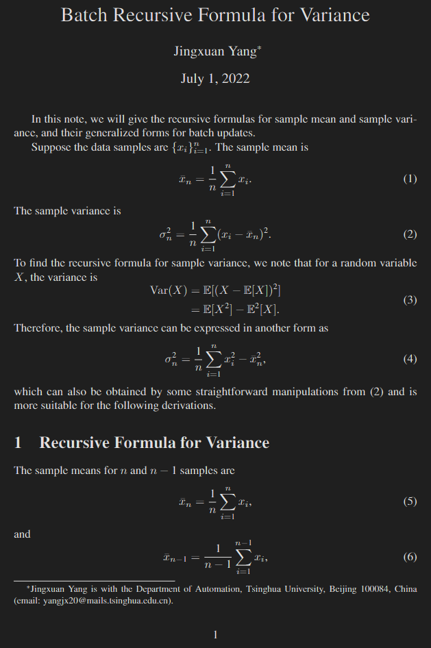
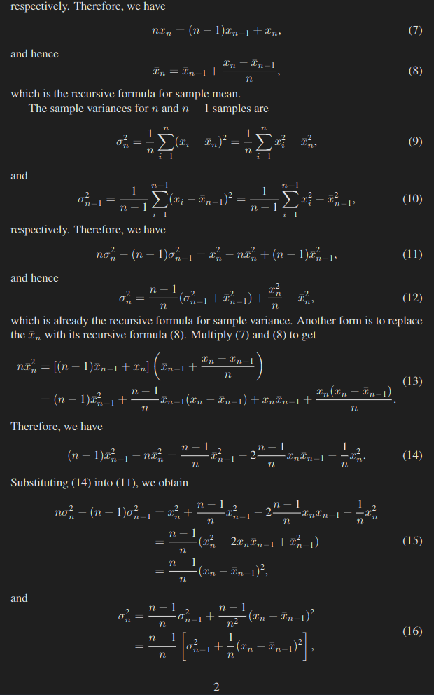
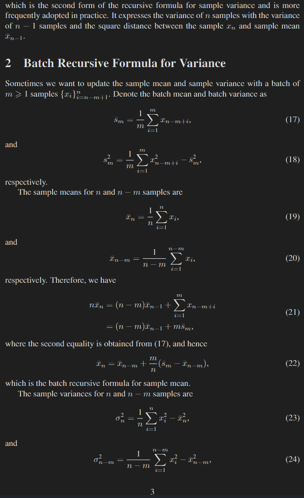
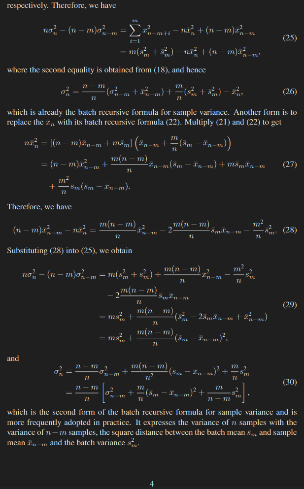

# Batch Recursive Formula for Variance

In this note, we will give the recursive formulas for sample mean and sample variance, and their generalized forms for batch updates.

Cite this note:

```
@online{yang2022batch,
        title={Batch Recursive Formula for Variance},
        author={Jingxuan Yang},
        year={2022},
        month={July},
        url={\url{}},
}
```





